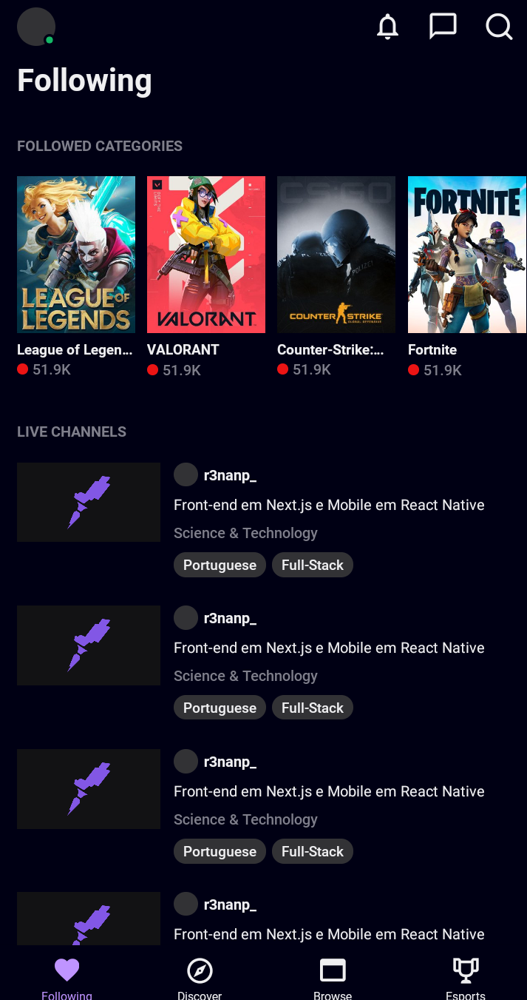

# Twitch App Clone
  A clone of Twitch TV made in React Native. <br />
  
  

## Technologies
* React Native
* React Navigator
* styled-components

## How to run

```
# Clone repository

git clone https://github.com/r3nanp/twitch-app-clone.git
```

```
# At the root of the project, run:

yarn
```

```
# Run app in your machine

yarn start or npm start
```

## Screenshot
  
